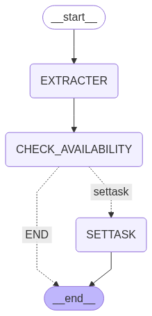
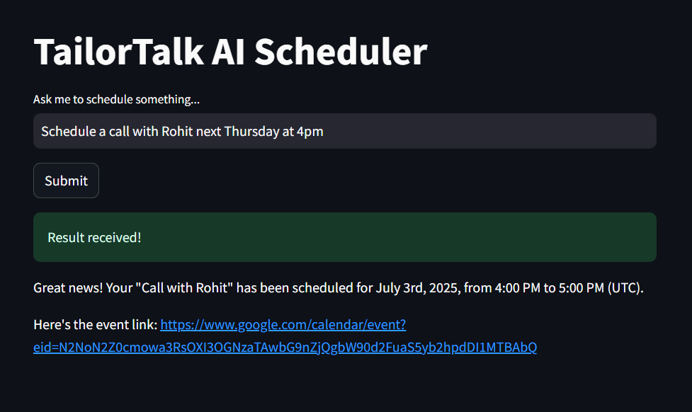
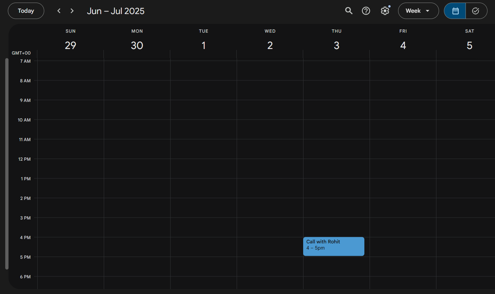
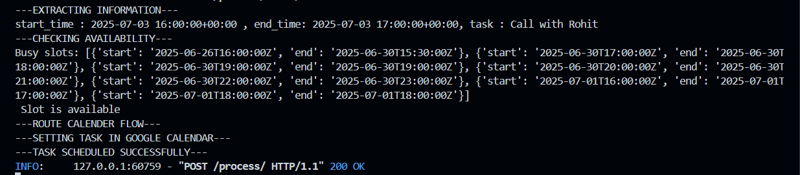

# 📅 SchedulaAI

SchedulaAI is a conversational AI scheduling assistant that takes natural language input from users, extracts task details (date, time, task), checks Google Calendar for availability, and either books the slot or suggests alternatives. It's built using **LangGraph**, **Google Calendar API**, **FastAPI**, and **Streamlit**.

---

## 🔗 Live Demo

👉 [Visit Streamlit App](https://schedulaai.streamlit.app/)

---

## 🧠 How It Works

```

User Input → LangGraph AI Agent →
→ Extract Time & Task →
→ Check Google Calendar Availability →
→ Schedule if free, suggest if busy →
→ Return final message to frontend

```

---

## 🖼️ Flow Diagram



---

## ⚙️ Technologies Used

- `LangGraph` — for multi-step agent workflow
- `FastAPI` — as backend server
- `Streamlit` — frontend interface
- `Google Calendar API` — for scheduling
- `LangChain + Gemini API` — for task + time extraction
- `dotenv`, `Pydantic` — config + validation

---

## 🗂️ Project Structure

```

├── ai\_agent/
│   ├── chains/
│   │   └── extract\_chain.py         # LLM prompt to extract task/time
│   ├── nodes/
│   │   ├── check\_availability.py    # Checks GCal slot availability
│   │   ├── extract\_information.py   # Parses extracted values
│   │   ├── settask\_in\_calendar.py   # Books slot in calendar
│   ├── state.py                     # Shared LangGraph state
│   ├── graph.py                     # Defines LangGraph flow
│   └── graph.png                    # Visual diagram of agent flow
│   
|
├── agent\_runner.py                  # LangGraph agent runner
└── credentials.json             # Google OAuth credentials
├── app.py                           # FastAPI backend
├── main.py                          # Streamlit frontend
├── .env                             # Environment vars (API keys etc.)
├── requirements.txt                 # Python dependencies

```

---

## 📦 API Endpoint

FastAPI backend (hosted on Render) processes scheduling:

```

POST [https://schedulaai.onrender.com/process/](https://schedulaai.onrender.com/process/)
Body:
{
"input": "Schedule a call with Rohit next Thursday at 4pm"
}

````

---

## 🌐 Local vs Remote Backend Setup

By default, the frontend uses the hosted backend (`https://schedulaai.onrender.com`).  
To run locally, modify your `main.py`:

```python
response = requests.post(
    "http://localhost:8000/process/",  # Change this for local testing
    json={"input": user_input}
)
````

---

## 🔐 .env File (required)

Create a `.env` file at the root level:

```env
GOOGLE_API_KEY=your-gemini-api-key
```


### 🔐 Google Calendar Setup (credentials.json)

To enable Google Calendar access, you must place your **Google OAuth credentials** file in project folder

#### 📁 Required File

```
credentials.json
```

#### 🪪 How to Generate Your Own `credentials.json`

1. Go to the [Google Cloud Console](https://console.cloud.google.com/).
2. Create a new project (or select an existing one).
3. Navigate to **"APIs & Services" > "Credentials"**.
4. Click **"Create Credentials"** > **"OAuth client ID"**.
5. Choose **"Desktop App"** as the application type.
6. Download the generated `credentials.json`.

#### 📌 Don’t Forget
✅ Enable Google Calendar API
Go to the Google API Library and enable the Google Calendar API for your project.

👤 Add Test User Email
If you're using OAuth client credentials, make sure to add your Google account as a test user in the OAuth consent screen.

🔐 Authorize on First Run
The first time you run the project locally, a browser window will prompt you to log in with your Google account and authorize calendar access.


---

## 🛠️ Setup Instructions (Local)

```bash
# Clone the repo
git clone https://github.com/Rohit131313/SchedulaAI.git
cd SchedulaAI

# Create virtual environment
conda create -n schedulaai python=3.10
conda activate schedulaai

# Install required packages
pip install -r requirements.txt

# Run backend
uvicorn app:app --reload

# Run frontend
streamlit run main.py
```

---

## 🧠 LangGraph Flow Summary

LangGraph handles a 3-step AI agent workflow:

1. **extract\_information.py**
   ➤ Uses Gemini to extract structured datetime and task info.

2. **check\_availability.py**
   ➤ Queries Google Calendar for conflicting events.

3. **settask\_in\_calendar.py**
   ➤ Schedules the task if free; suggests otherwise.

All connected via `graph.py` using `LangGraph`.

---

## ✨ Sample Interaction

```
User: "Book a call with Rohit next Thursday at 3 PM"
→ Gemini extracts: start_time, end_time, task
→ Checks Google Calendar
→ If free: schedules task + returns link
→ If busy: returns free time suggestions
```

---

## 📸 Screenshot Output (Example UI)





---

## ✅ Deployment Support

* Hosted Backend: Render
* Hosted Frontend: Streamlit Cloud
* Includes `.env` and credential setup

